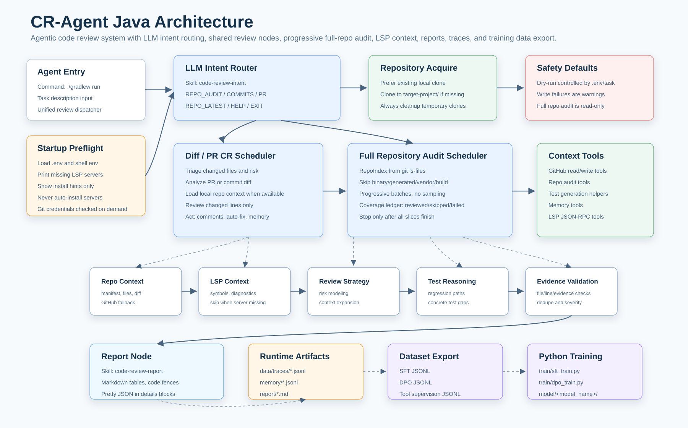

# CR-Agent

> 注：本 README 由 GPT-5.5 生成。



CR-Agent 是一个 Java 实现的 agentic code review 系统。它面向 PR、commit diff、默认分支最新提交和全量仓库审查，能够自动识别 review 目标、收集上下文、执行多阶段代码审查、记录完整轨迹，并导出 AgenticRL rollout 与 reward 数据。

当前主 agent 使用 Java/Gradle 工程实现，AgenticRL 训练脚本保留在 Python 侧。

## 核心能力

- LLM 意图识别：判断任务是全量仓库 CR、commit diff CR、PR CR，还是默认最新提交 CR。
- PR review：读取 GitHub PR 元信息、diff、changed files、review comments、CI checks 和仓库上下文。
- Commit range review：支持 `base...head`，也支持只给仓库时默认审查默认分支最新提交区间。
- 全量仓库 CR：当用户明确说“整个仓库/全量/全部代码/repo audit”时触发，不做抽样，采用渐进式加载覆盖全部可审查文件。
- LSP 增强：全量 CR 和 diff CR 都可启动真实 Language Server Protocol 服务，读取 document symbols、definitions、references、hover 和 diagnostics，用于跨文件影响分析与证据校验。
- 本机 Git 优先：优先使用本机 clone；如果没有本地 clone，会临时 clone 到 `target-project/` 生成 diff 并在结束后清理；`GITHUB_TOKEN` 作为 GitHub API fallback。
- 五阶段主流程：`Triage -> Analyze -> Review -> Act -> Report`。
- 深度 review 策略：Context Expansion、Risk Modeling、Regression/Test Reasoning、Evidence Validation。
- 工具系统：GitHub 读写工具、Memory 工具、测试生成工具、全仓库工具、LSP 工具统一注册到 `ToolRouter`。
- 安全执行：默认 dry-run；真实写操作失败不会阻塞 review 主流程。
- 轨迹记录：每次运行写入 JSONL trace，包含 phase、LLM 请求/响应、tool call/result、issue、action 和错误。
- Memory 系统：记录 developer profile、repo pattern、false positive 规则和 health report。
- 数据导出：从 trace 导出 AgenticRL episodes 与 reward labels。

## 工程结构

```text
CR-Agent/
├── README.md
├── .env.example
├── docs/
│   └── architecture.svg
├── cr_agent/
│   ├── build.gradle.kts
│   ├── settings.gradle.kts
│   ├── src/main/java/com/cragent/
│   │   ├── agent/          # CodeReviewAgent 主流程与结果解析
│   │   ├── cli/            # 运行入口、意图解析、本机 Git/GitHub token 检查
│   │   ├── config/         # .env 与环境变量配置
│   │   ├── datasets/       # AgenticRL rollout/reward 导出
│   │   ├── llm/            # OpenAI-compatible LLM client
│   │   ├── memory/         # JSONL memory store
│   │   ├── model/          # Agent/issue/tool 数据模型
│   │   ├── skills/         # skill prompt loader
│   │   ├── tools/          # GitHub、Memory、TestGeneration、ToolRouter
│   │   ├── trace/          # JSONL trajectory recorder
│   │   └── util/           # JSON、retry、path helpers
│   ├── src/main/resources/skills/
│   │   ├── code-review/
│   │   ├── code-review-act/
│   │   ├── code-review-analyze/
│   │   ├── code-review-java-runtime/
│   │   ├── code-review-memory/
│   │   ├── code-review-test-gen/
│   │   └── code-review-triage/
│   ├── src/test/java/com/cragent/
│   └── data/
│       ├── traces/
│       └── memory/
├── datasets/
│   └── RL/
├── train/
│   └── agentic_rl_train.py
└── model/
```

## 执行流程

CR-Agent 现在不是两套割裂流程，而是“共享 CR 节点库 + 不同调度入口”：

- 共享节点：`RepoContext`、`LSPContext`、`StaticChecks`、`RiskModel`、`ContextExpansion`、`Regression/TestReasoning`、`ReviewStrategy`、`EvidenceValidation`、`Report`、`Memory`。
- diff CR 调度：围绕 changed files / changed lines / patch hunks 运行共享节点。
- 全量 CR 调度：用 `RepoIndex + CoverageLedger + ProgressiveReview` 做全仓库覆盖调度，但每个 batch 仍使用同一套 `RiskModel`、`Regression/TestReasoning`、`ReviewStrategy` 和 `EvidenceValidation` 语义。

共享节点对应的主要实现类：

- `RepoContextNode`：为 diff CR 生成本地 repo manifest、LSP context、static checks。
- `ReviewAnalysisNodes`：统一实现 `RiskModel`、`Regression/TestReasoning`、`ReviewStrategy`，全量 CR 通过 repo-wide synthetic triage 复用这些节点。
- `EvidenceValidationNode`：统一实现 diff CR 与全量 CR 的证据校验、去重、置信度校准和 false-positive memory 过滤。
- `LspAnalyzer` / `JsonRpcLspClient` / `LspServerRegistry`：真实 LSP JSON-RPC、server 探测与缺失提示。

1. `CrAgentCli` 启动 agent 运行入口。
2. 意图识别节点加载 `code-review-intent` skill，由 LLM 输出 `REPO_AUDIT|COMMITS|PR|REPO_LATEST|HELP|EXIT|UNKNOWN`；模型失败时 fallback 到规则 parser。
3. 如果是 repo-only 且没有“全量/整个仓库”语义，agent 会尝试读取默认分支最新提交区间。
4. `GitEnvironment` 优先使用本机 Git 环境和本地 clone 生成 review context。
5. 如果本机没有 clone，agent 会临时 clone 到项目根的 `target-project/`，生成上下文后无论成功失败都会清理。
6. 如果本机 Git/临时 clone 不可用，agent 使用 `GITHUB_TOKEN` 通过 GitHub API 获取 PR 或 commit context。
7. diff CR 的 `Analyze` 会在 Context Expansion 后尝试加载本地仓库 LSP 上下文，把 changed files 的 symbols、diagnostics 和 server/install 状态传给 Review。
8. `CodeReviewAgent` 执行主流程：
   - `Triage`：判断 docs-only、draft、大变更、风险文件、是否需要人工介入。
   - `Analyze`：收集 diff、文件列表、CI、comments、依赖配置、相关测试、敏感路径和 memory。
   - `Review`：调用 LLM 输出结构化 JSON issues。
   - `Act`：dry-run 或真实执行 review comments、auto-fix PR、memory update 等动作。
   - `Report`：加载 `code-review-report` skill，调用 LLM 生成 report draft，并写入 `report/`。
9. `Evidence Validation` 在行动前过滤证据不足、行号不在 diff、重复或低置信度的问题。
10. `TraceRecorder` 将完整运行轨迹写入 `cr_agent/data/traces/*.jsonl`。

全量仓库 CR 使用独立流程：

```text
RepoAcquire -> RepoIndex -> LSPContext -> RiskModel -> StaticChecks -> ProgressiveReview -> EvidenceValidation -> Report
```

其中 `ProgressiveReview` 会先索引全仓库，再按模块/文件/片段逐批加载。batch 顺序可以按风险排序，但所有未被 build/vendor/generated/binary/cache 规则排除的文件都会进入 coverage ledger，不做抽样。

`LSPContext` 会按项目语言启动真实 LSP server，并通过 JSON-RPC 调用标准 LSP 方法。当前支持的 server：

- Java：`jdtls`
- JavaScript/TypeScript：`typescript-language-server --stdio`
- Python：`pyright-langserver --stdio`
- Go：`gopls`
- Rust：`rust-analyzer`

如果 `CR_AGENT_LSP_ENABLED=true` 且对应 server 未安装，agent 会在启动时提示缺失项和安装方法，但不会自动安装。任务执行中如果遇到对应语言的 server 缺失，会跳过该语言的 LSP 并继续后续 CR；agent 不会用正则结果伪装 LSP 输出。

## 配置

复制示例配置：

```bash
cp .env.example .env
```

当前 Java agent 会读取：

- 当前目录 `.env`
- 如果在 `cr_agent/` 内运行，也会读取父目录 `../.env`
- 项目 `.env` 会覆盖同名系统环境变量

示例：

```env
OPENAI_BASE_URL=https://token-plan-cn.xiaomimimo.com/v1
OPENAI_API_KEY=replace-me
OPENAI_MODEL=mimo-v2.5-pro
CR_AGENT_LLM_TIMEOUT_SECONDS=300
CR_AGENT_LLM_THINKING_MODE=auto
# DeepSeek context cache is server-side; no extra request parameter is needed.
# When the provider returns prompt_cache_hit_tokens / prompt_cache_miss_tokens,
# CR-Agent records them as llm_usage trace events.

# 可选。没有 token 时仍可使用本机 Git 路径或 dry-run/local flow。
GITHUB_TOKEN=

CR_AGENT_DRY_RUN=true
CR_AGENT_TRACE_DIR=data/traces
CR_AGENT_MEMORY_DIR=data/memory
CR_AGENT_MEMORY_READ_ENABLED=true
CR_AGENT_REPORT_DIR=report
CR_AGENT_MAX_ITERATIONS=30
CR_AGENT_MAX_TOOL_RESULT_CHARS=12000
CR_AGENT_REPO_AUDIT_RUN_CHECKS=true
CR_AGENT_LSP_ENABLED=true
CR_AGENT_LSP_TIMEOUT_SECONDS=30
```

配置说明：

- `OPENAI_BASE_URL`：OpenAI-compatible `/v1` base URL。
- `OPENAI_API_KEY`：LLM API key。
- `OPENAI_MODEL`：review 使用的模型名。
- `CR_AGENT_LLM_TIMEOUT_SECONDS`：单次 LLM HTTP 请求超时时间；不是整轮 CR 总超时，超时后走 retry/节点降级。
- `CR_AGENT_LLM_THINKING_MODE`：可选 `auto|enabled|disabled`。DeepSeek V4 在 `auto` 或未设置时默认发送 `thinking.disabled`，避免 tool-call 多轮协议要求额外传递 reasoning 内容导致中断。
- DeepSeek cache：无需额外配置；agent 会保持稳定 prompt 前缀，并在 trace 的 `llm_usage` 事件中记录 `prompt_cache_hit_tokens` / `prompt_cache_miss_tokens`。
- `GITHUB_TOKEN`：GitHub API fallback 和真实 PR 写操作所需 token。
- `CR_AGENT_DRY_RUN`：默认建议 `true`，避免直接写 GitHub。
- `CR_AGENT_TRACE_DIR`：trace 输出目录，相对 `cr_agent/` 工作目录。
- `CR_AGENT_MEMORY_DIR`：memory 输出目录，相对 `cr_agent/` 工作目录。
- `CR_AGENT_MEMORY_READ_ENABLED`：是否读取历史 memory；benchmark/eval 建议设为 `false`，避免历史规则污染评测样本。
- `CR_AGENT_REPORT_DIR`：review report 输出目录；相对路径会解析到项目根目录，默认 `report/`。
- `CR_AGENT_MAX_ITERATIONS`：agent tool-use 最大轮数。
- `CR_AGENT_MAX_TOOL_RESULT_CHARS`：单次工具返回最大字符数。
- `CR_AGENT_REPO_AUDIT_RUN_CHECKS`：全量 CR 是否运行只读静态检查。
- `CR_AGENT_LSP_ENABLED`：是否启用真实 LSP JSON-RPC 上下文增强。
- `CR_AGENT_LSP_TIMEOUT_SECONDS`：单次 LSP 请求超时时间。

## Java 环境要求

当前 Java agent 位于 `cr_agent/`，通过 Gradle Wrapper 运行，不需要单独安装系统 Gradle。

最低要求：

- JDK 21 或更高版本。
- macOS/Linux shell 环境，Windows 可使用 `gradlew.bat`。
- 网络可访问配置的 `OPENAI_BASE_URL`。
- 如果需要读取私有仓库或真实写 GitHub review，需要本机 Git 凭据或 `GITHUB_TOKEN`。
- 如果启用 LSP，需要按仓库语言安装对应 language server，并确保命令在 `PATH` 中。

推荐环境：

- IntelliJ IDEA 2024+。
- 使用项目自带 Gradle Wrapper：`cr_agent/gradlew`。
- 本机已配置 Git SSH key，并能执行 `git ls-remote git@github.com:owner/name.git HEAD`。

检查 Java：

```bash
java -version
```

期望版本类似：

```text
openjdk version "21..."
```

如果本机没有 JDK 21，可以用 SDKMAN 安装：

```bash
curl -s "https://get.sdkman.io" | bash
sdk install java 21.0.6-tem
```

也可以使用 Homebrew：

```bash
brew install openjdk@21
```

agent 启动时会检查 LSP server。缺失时请按需自行安装：

```bash
npm install -g typescript typescript-language-server pyright
go install golang.org/x/tools/gopls@latest
rustup component add rust-analyzer
brew install jdtls
```

在 IntelliJ IDEA 中打开：

1. 打开 `CR-Agent/cr_agent/`。
2. 选择 Gradle JVM 为 JDK 21+。
3. 使用 Gradle task `run` 或 `test`。
4. 使用 Gradle task `run` 启动 agent。

注意：建议从 `cr_agent/` 目录运行命令。此时 agent 会读取父目录 `../.env`，也会读取当前目录 `.env`；当前目录 `.env` 优先级最高。

## 快速开始

进入 Java 工程：

```bash
cd cr_agent
./gradlew test
```

启动 agent：

```bash
./gradlew run
```

示例任务描述：

```text
帮我 review https://github.com/owner/repo.git
对整个 https://github.com/owner/repo.git 做 CR
review https://github.com/owner/name/pull/123
review owner/name 从 main 到 feature-branch
review https://github.com/owner/name/compare/main...feature-branch
live review owner/name 从 6e83187b 到 0224b0ec
```

如果只给仓库，agent 会默认 review 默认分支最新提交区间。

## 使用方式

当前 Java agent 通过一个统一运行入口接收任务描述，不再通过命令行参数触发不同 review 类型：

```bash
./gradlew run
```

启动后告诉 agent 要 review 的对象，例如 PR、两个 commit、仓库最新提交或全量仓库 CR。

LSP 工具也可以被 agent 调用：

```text
lsp_detect_servers
lsp_workspace_symbols
lsp_document_symbols
lsp_definition
lsp_references
lsp_hover
lsp_diagnostics
```

Git、GitHub token、memory、trace 和 dataset 导出能力仍在代码中保留给内部流程使用；对外只保留统一运行入口。

## Fresh Raw 数据采集

用于训练前收集非 benchmark 的 raw review 任务：

```bash
scripts/run_raw_dataset.sh --limit 1000
```

该脚本会按 CR-Agent 当前支持语言生成 `datasets/raw/tasks.jsonl`，默认约 80% diff CR、20% 完整仓库 CR，并排除现有 benchmark 仓库与 PR。实际执行入口：

```bash
cd cr_agent
./gradlew run --args="run-dataset --tasks ../datasets/raw/tasks.jsonl --limit 1000 --resume"
```

输出包括：

```text
datasets/raw/source_queries.jsonl
datasets/raw/denylist.json
datasets/raw/tasks.jsonl
datasets/raw/runs/<run_id>/manifest.json
cr_agent/data/traces/raw/<run_id>/*.jsonl
```

训练前清洗 raw manifest：

```bash
scripts/clean_raw_dataset.sh
scripts/clean_raw_dataset.sh --require-success
```

清洗输出：

```text
datasets/clean/tasks.clean.jsonl
datasets/clean/results.clean.jsonl
datasets/clean/clean_report.json
```

## Review 输出

命令行会输出：

```text
Status: completed
Summary: ...
Trace: data/traces/<session>.jsonl
Report: /path/to/CR-Agent/report/<session>-owner-repo.md
Issues: 0
Actions: 2
```

## Report 输出

每次 review 结束都会进入 `REPORT` 节点：

1. 加载 `src/main/resources/skills/code-review-report/SKILL.md`。
2. 把 session、repo、target、summary、issues、actions、trace path 传给 LLM。
3. 要求 LLM 返回结构化 report draft JSON。
4. 将最终 Markdown report 写入 `report/` 目录。

默认输出位置：

```text
report/<session>-<owner-repo>.md
report/<session>-<owner-repo>-repo-audit.md
```

如果 Report 节点的 LLM 调用失败，agent 会写一份 deterministic fallback report；这不会影响主 review 的完成状态。

Issue JSON schema 由 skill prompt 约束，核心字段包括：

```json
{
  "severity": "critical|high|medium|low|info",
  "category": "security|bug|style|performance|maintainability|tests",
  "file": "path/to/file",
  "line": 123,
  "body": "problem",
  "evidence": "exact diff/config/check evidence",
  "impact": "why this matters",
  "suggestion": "fix",
  "autoFixable": false,
  "fixCode": null,
  "confidence": 0.9
}
```

## ToolRouter 与工具层

`ToolRouter` 负责统一注册和执行工具：

- 参数 schema 校验
- 未知工具拦截
- dry-run 写操作拦截
- 大响应截断
- tool call / tool result trace 记录
- 工具异常降级为可读错误，避免轻易 crash 主流程

已实现工具包括：

- GitHub read：PR、diff、changed files、review comments、checks、commit compare、code search、file contents。
- GitHub write：submit review comments、create branch、create or update file、create PR。
- Memory：rules、developer profile、repo patterns、false positives、health report。
- Test generation：框架探测、测试路径推断、测试建议生成。

## Memory

Memory 存在 `cr_agent/data/memory/`，使用 JSONL 文件保存：

- repo review patterns
- developer profile
- issue history
- false positive rules
- health report aggregation

Memory 会参与后续 review，用于降低重复误报、补充团队偏好和识别仓库长期风险模式。

## Trace 与数据导出

每次运行都会写入 trace：

```text
cr_agent/data/traces/<session>.jsonl
```

事件类型包括：

```text
session_start
phase_start
llm_request
llm_response
tool_call
tool_result
issue_found
action_taken
memory_update
session_end
```

输出目录：

```text
datasets/RL/episodes.jsonl
datasets/RL/rewards.jsonl
```

`episodes.jsonl` 面向 AgenticRL：每行是一个完整 agent rollout，包含
`state -> action -> observation -> reward -> done`。`rewards.jsonl` 是对应
session 的终局 reward 与组件分解，默认使用可解释的 trace heuristic，后续可
用 benchmark TP/FP/FN 或人工反馈替换。

## Python 训练

Java 负责 agent 执行和数据导出。AgenticRL 训练由 Python 脚本执行，Python
环境使用 `uv` 创建和管理：

```bash
uv sync
uv run python train/agentic_rl_train.py \
  --base-model Qwen/Qwen2.5-Coder-7B-Instruct \
  --model-name qwen2.5-coder-7b \
  --episodes datasets/clean/RL/episodes.clean.jsonl \
  --rewards datasets/clean/RL/rewards.clean.jsonl
```

训练脚本支持 `--device auto|cuda|mps|cpu`。默认 `auto` 会优先使用 CUDA，其次
Apple MPS，最后 CPU。CUDA 环境先用 `uv` 创建环境，再安装匹配驱动的 CUDA
PyTorch wheel，例如 CUDA 12.4：

```bash
uv sync
uv pip install --upgrade torch --index-url https://download.pytorch.org/whl/cu124
uv run python train/agentic_rl_train.py ... --device cuda --dtype float16
```

模型和权重输出：

```text
model/<model_name>/agentic_rl/
```

## 开发与验证

运行测试：

```bash
cd cr_agent
./gradlew test
```

真实链路 smoke test：

```bash
cd cr_agent
./gradlew run
```

然后输入：

```text
帮我 review https://github.com/owner/repo.git
```

如果本机存在该仓库 clone，agent 会优先使用本机 Git 生成 diff；否则会临时 clone 到 `target-project/`，生成上下文后自动删除；如果 clone 不可用，再尝试使用 GitHub API。

## 安全建议

- 首次运行建议保持 `CR_AGENT_DRY_RUN=true`。
- 确认 GitHub token 权限后，再切换到 `CR_AGENT_DRY_RUN=false`。
- 写权限失败不应阻塞 review，agent 会继续输出 summary、issues、actions 和 trace。
